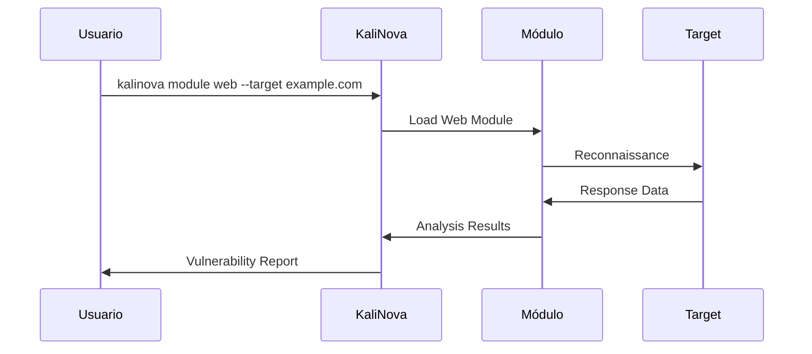
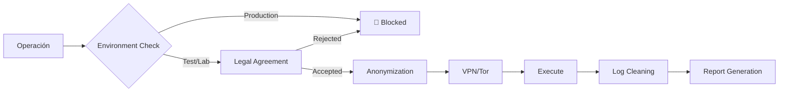
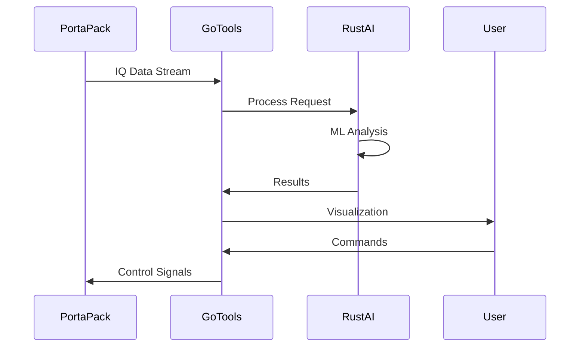
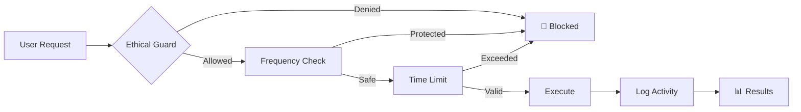

# -PortaPack-Havoc-Mod-KevDevSecOps-

📻 **¡Que las ondas estén contigo!**

Entorno de seguridad ofensiva todo-en-uno con arquitectura modular


📦 Módulos Principales

1. 🎯 KaliNova Core (core/)

```bash
# Instalación
git clone https://github.com/KevinDevSecOps/KaliNova
cd KaliNova && sudo ./install.sh

# Características
- Kali Linux optimizado
- Gestor de módulos unificado
- Asistente AI integrado
- Entorno Dockerizado
```

2. 🔍 Web Assessment (modules/web/)

```bash
# Ejecución
kalinova module web --target https://example.com

# Herramientas
- BurpSuite Nova Edition
- Nuclei con templates AI
- XSS/SQLi Scanner avanzado
- API Security Testing
```

3. 🌐 Network Analysis (modules/network/)

```bash
# Escaneo
kalinova module network --scan 192.168.1.0/24

# Features
- Reconocimiento automático
- Análisis de tráfico AI
- Detección de anomalías
- Pentesting LAN/WAN
```

4. 📡 Wireless Audit (modules/wireless/)

```bash
# Auditoría WiFi
kalinova module wireless --wifi --scan

# Capacidades
- Pentesting WiFi 6/6E
- Auditoría RF con SDR
- Análisis Bluetooth/BLE
- IoT Device Testing
```

🔄 Flujo de Pentesting



🛡️ Esquema de Seguridad Operacional



⚙️ Instalación Rápida

```bash
# Instalación automática
curl -sSL https://bit.ly/kalinova-install | bash

# O instalación manual
git clone https://github.com/KevinDevSecOps/KaliNova
cd KaliNova
chmod +x install.sh
sudo ./install.sh --full
```

🚀 Uso Básico

```bash
# Menú principal interactivo
kalinova --gui

# línea de comandos
kalinova module <module-name> [options]

# Ejemplos:
kalinova module web --target https://example.com --deep-scan
kalinova module network --scan 10.0.0.0/24 --osint
kalinova module wireless --wifi --audit
```

📋 Stack Tecnológico

Capa Tecnologías Descripción
Core Python, Docker, AI Models Núcleo del sistema
Web BurpSuite, Nuclei, ZAP Testing web y APIs
Network Nmap, Masscan, Zeek Análisis de red
Wireless Aircrack-ng, Wireshark, SDR Pentesting inalámbrico
Cloud ScoutSuite, Cloudsploit Seguridad cloud

🔧 Estructura de Proyecto

```
KaliNova/
├── core/                 # Núcleo del sistema
├── modules/              # Módulos de pentesting
│   ├── web/              # Assessment web
│   ├── network/          # Análisis de red
│   ├── wireless/         # Auditoría inalámbrica
│   └── cloud/            # Seguridad cloud
├── config/               # Configuraciones
├── docs/                 # Documentación
└── install.sh           # Instalador
```

🎯 Roadmap 2024

· v1.0 - Core estable con módulos básicos
· v1.5 - Integración AI avanzada
· v2.0 - Interfaz web unificada
· v2.5 - Módulos cloud enterprise
· v3.0 - Plataforma SaaS enterprise

⚠️ Aviso Legal

KaliNova es solo para:

· ✅ Pentesting autorizado
· ✅ Educación en seguridad
· ✅ Investigación ethical
· ✅ Desarrollo defensivo

NUNCA para:

· ❌ Actividades ilegales
· ❌ Acceso no autorizado
· ❌ Daño a sistemas
· ❌ Violación de privacidad

---

📄 Licencia: GPLv3 - 👤 Autor: KevinDevSecOps
🐛 Reportar Issues: GitHub Issues
📚 Documentación: Wiki
## Comunidad
[](https://github.com/KevinDevSecOps)
- [Código de Conducta](CODE_OF_CONDUCT.md)
- [Política de Seguridad](SECURITY.md)
- [Guía para Contribuir](CONTRIBUTING.md)

**Proyecto modular para PortaPack Havoc con herramientas en múltiples lenguajes.**
📻 PortaPack Havoc Mod - TX/RX Toolkit

Framework modular para investigación RF ética con PortaPack

⚠️ Nota: Smart Jamming solo para investigación autorizada en entornos controlados

📦 Módulos Principales

1. 🎯 Firmware C++ (firmware-cpp/)

```bash
# Compilación
make clean && make

# Características
- Control hardware radio
- Operaciones tiempo real
- Apps TX/RX integradas
- Interfaz serial segura
```

2. 🕹️ Herramientas Go (tools-go/)

```bash
# Build
go build -o portapack-control

# Uso
./portapack-control /dev/ttyACM0 --analyze --freq 433.92
```

3. 📊 Procesamiento Rust (signal-processing-rust/)

```bash
# Build
cargo build --release

# Análisis
./target/release/portapack-ai --input capture.iq --analyze
```

🔄 Flujo de Datos



🛡️ Esquema de Seguridad



⚙️ Configuración Rápida

1. Flash Firmware:

```bash
cd firmware-cpp && make && make flash
```

1. Control Básico:

```bash
cd tools-go && go run main.go --help
```

1. Análisis:

```bash
cd signal-processing-rust && cargo run -- --analyze
```

📋 Especificaciones Técnicas

Módulo Lenguaje Uso Principal Dependencias
Firmware C++ Control hardware libopencm3
Tools Go Automatización serial lib
AI Analysis Rust Procesamiento linfa, rustfft

🔧 Endpoints Serial

```
FREQ <freq_hz>      # Set frequency
MOD <modulation>    # Set modulation
TX START/STOP       # Control TX
RX START/STOP       # Control RX
CAPTURE <ms>        # Capture data
```

🚨 Importante

TODO USO DE TRANSMISIÓN REQUIERE:

· ✅ Licencias apropiadas
· ✅ Entorno controlado
· ✅ Autorización por escrito
· ✅ Documentación completa

---

¿Preguntas? Abre un issue en GitHub
## 🚀 Novedades (Actualización Reciente)

Se ha añadido soporte para herramientas externas en Go y Rust:
- **Control remoto** del PortaPack mediante interfaz serial
- **Procesamiento avanzado** de señales con Rust
- **Automatización** de pruebas y capturas

## 📁 Estructura del Proyecto

### 1. Firmware C++ Principal (`firmware-cpp/`)
- Firmware principal para PortaPack
- Control de hardware de radio
- Operaciones en tiempo real
- Apps de TX/RX integradas

### 2. Herramientas de Control en Go (`tools-go/`)
- Control remoto del PortaPack vía serial
- Automatización de pruebas
- Captura y análisis de datos
- Scripts de automatización

### 3. Procesamiento de Señales en Rust (`signal-processing-rust/`)
- Análisis avanzado de señales
- Algoritmos de demodulación
- Procesamiento intensivo
- Análisis espectral

## 🛠️ Compilación y Uso

### Firmware C++
```bash
cd firmware-cpp
make clean
make
# Flashear al PortaPack
```

### Herramientas Go
```bash
cd tools-go
go build -o portapack-control
./portapack-control /dev/ttyACM0
```

### Procesamiento Rust
```bash
cd signal-processing-rust
cargo build --release
./target/release/portapack-signal-processing captura.iq
```

## 🔧 Configuración Serial

El firmware debe estar compilado con soporte para comunicación serial:

```cpp
// En el firmware, habilitar interfaz serial
serial_init();
printf("PortaPack Havoc Mod ready\n");
```

## 📋 Funcionalidades Implementadas

### TX/RX Básico
- Transmisión en múltiples frecuencias
- Recepción con diferentes modulaciones
- Control de ganancia y ancho de banda

### Herramientas Avanzadas
- **Scanner de espectro** automático
- **Captura de IQ data** para análisis posterior
- **Inyección de señales** personalizadas
- **Análisis de protocolos** comunes

## 🎯 Próximas Características

- [ ] Soporte para más protocolos (ADS-B, LoRa, etc.)
- [ ] Interfaz web de control remoto
- [ ] Biblioteca de procesamiento de señales
- [ ] Tools para análisis de seguridad RF

## 📝 Licencia

MIT License - Ver LICENSE para detalles.

## 🤝 Contribución

¡Las contribuciones son bienvenidas! Por favor:

1. Haz fork del proyecto
2. Crea una rama para tu feature
3. Commit de tus cambios
4. Push a la rama
5. Abre un Pull Request

## 📊 Estado del Proyecto

**Estable**: 
- ✅ TX/RX básico funcionando
- ✅ Control serial implementado
- ✅ Procesamiento de señales

**En Desarrollo**:
- 🚧 Más modulaciones
- 🚧 Herramientas de análisis
- 🚧 Optimizaciones de performance

---

*¿Necesitas ayuda? Abre un issue en GitHub o contacta a @KevDevSecOps*
# PortaPack-Havoc Mod [by KevinDevSecOps] 
**Firmware avanzado para HackRF + PortaPack** en C/C++ con herramientas para pentesting RF, análisis de espectro y experimentación SDR.

 

[](LICENSE)
[](.github/workflows/build.yml)

## ✨ Features clave
- **Jammer inteligente** con barrido de frecuencias.
- **Scanner automático** (WiFi, BLE, 433MHz, etc.).
- **TX/RX Full-Duplex** experimental.
- **Compatibilidad con GNU Radio** (flujos personalizados).
- **Interfaz optimizada** para pentesting.

## 🛠 Instalación
### Requisitos
- **Hardware**: HackRF One + PortaPack.
- **Software**: 
  - Compilador ARM (`gcc-arm-none-eabi`).
  - CMake ≥ 3.10.
  - Python 3 (para scripts).

### Compilación
```bash
# Clona el repo
git clone https://github.com/KevinDevSecOps/portapack-havoc --recursive
cd portapack-havoc

# Compila
mkdir build && cd build
cmake .. -DCMAKE_TOOLCHAIN_FILE=../cmake/Toolchain-arm-none-eabi.cmake
make -j$(nproc)
```

### Flasheo
1. Conecta el PortaPack en modo **DFU** (mantén el botón Reset al conectar USB).
2. Flashea:
```bash
hackrf_spiflash -w firmware.bin
```

## 📌 Uso básico
| Aplicación       | Descripción                          | Shortcut          |
|------------------|-------------------------------------|-------------------|
| **Jammer**       | Interferencia en frecuencia fija    | Menú → Aplicaciones |
| **Spectrum**     | Análisis de espectro en tiempo real | Botón "RX"        |
| **Replay**       | Grabación/Inyección de señales      | Menú → Utilities  |

## 🚧 Roadmap (Tus próximas features)
- [ ] **Decoder de señales digitales** (ASK, FSK, LoRa).
- [ ] **Ataque replay mejorado** con almacenamiento en SD.
- [ ] **Soporte para plugins externos**.

## 🤝 Cómo contribuir
1. Haz un fork del proyecto.
2. Crea una rama (`git checkout -b feature/nueva-funcion`).
3. Envía un **Pull Request** con tus cambios.

## 📜 Licencia
Este proyecto usa **GNU GPLv3** (igual que el original).  
Ver [LICENSE](LICENSE) para detalles.

---

> 💡 **Nota**: Este README es un template. Personalízalo con:  
> - Capturas reales de tu firmware.  
> - Videos demostrativos (sube a YouTube y enlaza).  
> - Detalles técnicos de tus modificaciones.  
```
## 🐹 Herramientas en Go  
- `rf_analyzer`: Detecta frecuencias sospechosas en capturas.  
- `signal_cloner`: Prepara señales para el PortaPack.
---

### 🔥 **Pasos para implementarlo**
1. **Crea el archivo README.md** en la raíz de tu repo:
   ```bash
   touch README.md
   code README.md  # Abre con VS Code (o usa nano/vim)
   ```
2. **Copia el template** y ajusta:
   - Reemplaza `[by KevinDevSecOps]` con tu nombre/handle.
   - Añade imágenes reales (sube screenshots a `docs/images/`).
   - Actualiza la sección **Roadmap** con tus planes reales.

3. **Sube los cambios**:
   ```bash
   git add README.md
   git commit -m "README profesional inicial"
   git push origin main
   ```

---

## 🌟 Agradecimientos  
A toda la comunidad de **HackRF y PortaPack**, especialmente a los desarrolladores originales y colaboradores que hicieron posible este ecosistema abierto.  

## 🚀 Únete a la Comunidad  
¿Tienes ideas, preguntas o quieres colaborar? ¡Abramos un **Issue** o **Discusión** en el repo!  

---

**⚡ Proyecto creado con pasión por el hacking responsable, la radiofrecuencia y el código abierto.**  

**Hecho con ❤️ por [KevinDevSecOps](https://github.com/KevinDevSecOps)**  
*(¿Encontraste útil este proyecto? ¡Dale una ⭐ al repo!)*
