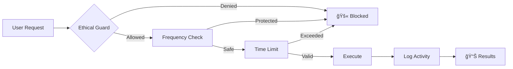

# -PortaPack-Havoc-Mod-KevDevSecOps-

📻 **¡Que las ondas estén contigo!**

Entorno de seguridad ofensiva todo-en-uno con arquitectura modular ofensiva by CK

**Proyecto modular para PortaPack Havoc con herramientas en múltiples lenguajes.**
📻 PortaPack Havoc Mod - TX/RX Toolkit

Framework modular para investigación RF ética con PortaPack

⚠️ Nota: Smart Jamming solo para investigación autorizada en entornos controlados

📦 Módulos Principales

1. 🎯 Firmware C++ (firmware-cpp/)

```bash
# Compilación
make clean && make

# Características
- Control hardware radio
- Operaciones tiempo real
- Apps TX/RX integradas
- Interfaz serial segura
```

2. 🕹️ Herramientas Go (tools-go/)

```bash
# Build
go build -o portapack-control

# Uso
./portapack-control /dev/ttyACM0 --analyze --freq 433.92
```

3. 📊 Procesamiento Rust (signal-processing-rust/)

```bash
# Build
cargo build --release

# Análisis
./target/release/portapack-ai --input capture.iq --analyze
```

🔄 Flujo de Datos


🛡️ Esquema de Seguridad



⚙️ Configuración Rápida

1. Flash Firmware:

```bash
cd firmware-cpp && make && make flash
```

1. Control Básico:

```bash
cd tools-go && go run main.go --help
```

1. Análisis:

```bash
cd signal-processing-rust && cargo run -- --analyze
```

📋 Especificaciones Técnicas

Módulo Lenguaje Uso Principal Dependencias
Firmware C++ Control hardware libopencm3
Tools Go Automatización serial lib
AI Analysis Rust Procesamiento linfa, rustfft

🔧 Endpoints Serial

```
FREQ <freq_hz>      # Set frequency
MOD <modulation>    # Set modulation
TX START/STOP       # Control TX
RX START/STOP       # Control RX
CAPTURE <ms>        # Capture data
```

🚨 Importante

TODO USO DE TRANSMISIÓN REQUIERE:

· ✅ Licencias apropiadas
· ✅ Entorno controlado
· ✅ Autorización por escrito
· ✅ Documentación completa

---

¿Preguntas? Abre un issue en GitHub
## 🚀 Novedades (Actualización Reciente)

Se ha añadido soporte para herramientas externas en Go y Rust:
- **Control remoto** del PortaPack mediante interfaz serial
- **Procesamiento avanzado** de señales con Rust
- **Automatización** de pruebas y capturas

## 📁 Estructura del Proyecto

### 1. Firmware C++ Principal (`firmware-cpp/`)
- Firmware principal para PortaPack
- Control de hardware de radio
- Operaciones en tiempo real
- Apps de TX/RX integradas

### 2. Herramientas de Control en Go (`tools-go/`)
- Control remoto del PortaPack vía serial
- Automatización de pruebas
- Captura y análisis de datos
- Scripts de automatización

### 3. Procesamiento de Señales en Rust (`signal-processing-rust/`)
- Análisis avanzado de señales
- Algoritmos de demodulación
- Procesamiento intensivo
- Análisis espectral

## 🛠️ Compilación y Uso

### Firmware C++
```bash
cd firmware-cpp
make clean
make
# Flashear al PortaPack
```

### Herramientas Go
```bash
cd tools-go
go build -o portapack-control
./portapack-control /dev/ttyACM0
```

### Procesamiento Rust
```bash
cd signal-processing-rust
cargo build --release
./target/release/portapack-signal-processing captura.iq
```

## 🔧 Configuración Serial

El firmware debe estar compilado con soporte para comunicación serial:

```cpp
// En el firmware, habilitar interfaz serial
serial_init();
printf("PortaPack Havoc Mod ready\n");
```

## 📋 Funcionalidades Implementadas

### TX/RX Básico
- Transmisión en múltiples frecuencias
- Recepción con diferentes modulaciones
- Control de ganancia y ancho de banda

### Herramientas Avanzadas
- **Scanner de espectro** automático
- **Captura de IQ data** para análisis posterior
- **Inyección de señales** personalizadas
- **Análisis de protocolos** comunes

## 🎯 Próximas Características

- [ ] Soporte para más protocolos (ADS-B, LoRa, etc.)
- [ ] Interfaz web de control remoto
- [ ] Biblioteca de procesamiento de señales
- [ ] Tools para análisis de seguridad RF

## 📝 Licencia

MIT License - Ver LICENSE para detalles.

## 🤝 Contribución

¡Las contribuciones son bienvenidas! Por favor:

1. Haz fork del proyecto
2. Crea una rama para tu feature
3. Commit de tus cambios
4. Push a la rama
5. Abre un Pull Request

## 📊 Estado del Proyecto

**Estable**: 
- ✅ TX/RX básico funcionando
- ✅ Control serial implementado
- ✅ Procesamiento de señales

**En Desarrollo**:
- 🚧 Más modulaciones
- 🚧 Herramientas de análisis
- 🚧 Optimizaciones de performance

---

*¿Necesitas ayuda? Abre un issue en GitHub o contacta a @KevDevSecOps*
# PortaPack-Havoc Mod [by KevinDevSecOps] 
**Firmware avanzado para HackRF + PortaPack** en C/C++ con herramientas para pentesting RF, análisis de espectro y experimentación SDR.

 

[](LICENSE)
[](.github/workflows/build.yml)

## ✨ Features clave
- **Jammer inteligente** con barrido de frecuencias.
- **Scanner automático** (WiFi, BLE, 433MHz, etc.).
- **TX/RX Full-Duplex** experimental.
- **Compatibilidad con GNU Radio** (flujos personalizados).
- **Interfaz optimizada** para pentesting.

## 🛠 Instalación
### Requisitos
- **Hardware**: HackRF One + PortaPack.
- **Software**: 
  - Compilador ARM (`gcc-arm-none-eabi`).
  - CMake ≥ 3.10.
  - Python 3 (para scripts).

### Compilación
```bash
# Clona el repo
git clone https://github.com/KevinDevSecOps/portapack-havoc --recursive
cd portapack-havoc

# Compila
mkdir build && cd build
cmake .. -DCMAKE_TOOLCHAIN_FILE=../cmake/Toolchain-arm-none-eabi.cmake
make -j$(nproc)
```

### Flasheo
1. Conecta el PortaPack en modo **DFU** (mantén el botón Reset al conectar USB).
2. Flashea:
```bash
hackrf_spiflash -w firmware.bin
```

## 📌 Uso básico
| Aplicación       | Descripción                          | Shortcut          |
|------------------|-------------------------------------|-------------------|
| **Jammer**       | Interferencia en frecuencia fija    | Menú → Aplicaciones |
| **Spectrum**     | Análisis de espectro en tiempo real | Botón "RX"        |
| **Replay**       | Grabación/Inyección de señales      | Menú → Utilities  |

## 🚧 Roadmap (Tus próximas features)
- [ ] **Decoder de señales digitales** (ASK, FSK, LoRa).
- [ ] **Ataque replay mejorado** con almacenamiento en SD.
- [ ] **Soporte para plugins externos**.

## 🤝 Cómo contribuir
1. Haz un fork del proyecto.
2. Crea una rama (`git checkout -b feature/nueva-funcion`).
3. Envía un **Pull Request** con tus cambios.

## 📜 Licencia
Este proyecto usa **GNU GPLv3** (igual que el original).  
Ver [LICENSE](LICENSE) para detalles.

---

> 💡 **Nota**: Este README es un template. Personalízalo con:  
> - Capturas reales de tu firmware.  
> - Videos demostrativos (sube a YouTube y enlaza).  
> - Detalles técnicos de tus modificaciones.  
```
## 🐹 Herramientas en Go  
- `rf_analyzer`: Detecta frecuencias sospechosas en capturas.  
- `signal_cloner`: Prepara señales para el PortaPack.
---

### 🔥 **Pasos para implementarlo**
1. **Crea el archivo README.md** en la raíz de tu repo:
   ```bash
   touch README.md
   code README.md  # Abre con VS Code (o usa nano/vim)
   ```
2. **Copia el template** y ajusta:
   - Reemplaza `[by KevinDevSecOps]` con tu nombre/handle.
   - Añade imágenes reales (sube screenshots a `docs/images/`).
   - Actualiza la sección **Roadmap** con tus planes reales.

3. **Sube los cambios**:
   ```bash
   git add README.md
   git commit -m "README profesional inicial"
   git push origin main
   ```

---

## 🌟 Agradecimientos  
A toda la comunidad de **HackRF y PortaPack**, especialmente a los desarrolladores originales y colaboradores que hicieron posible este ecosistema abierto.  

## 🚀 Únete a la Comunidad  
¿Tienes ideas, preguntas o quieres colaborar? ¡Abramos un **Issue** o **Discusión** en el repo!  

---

**⚡ Proyecto creado con pasión por el hacking responsable, la radiofrecuencia y el código abierto.**  

**Hecho con ❤️ por [KevinDevSecOps](https://github.com/KevinDevSecOps)**  
*(¿Encontraste útil este proyecto? ¡Dale una ⭐ al repo!)*
